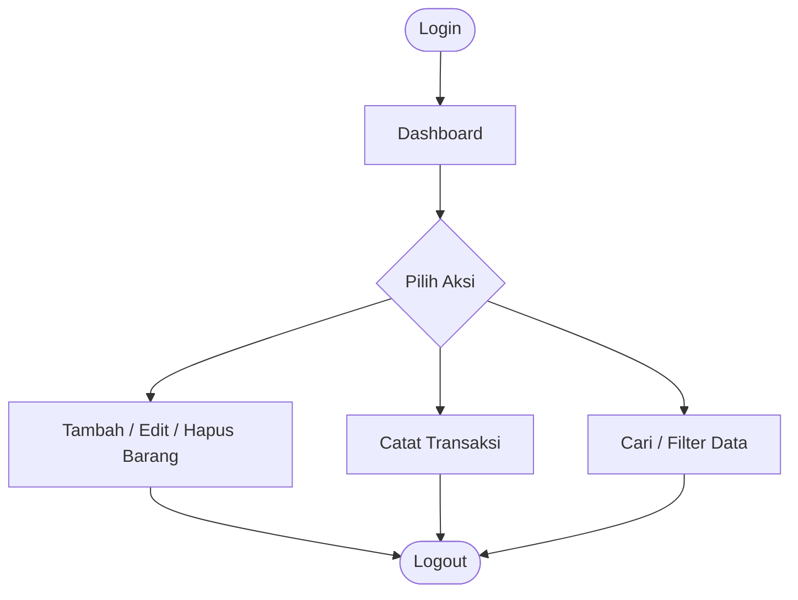
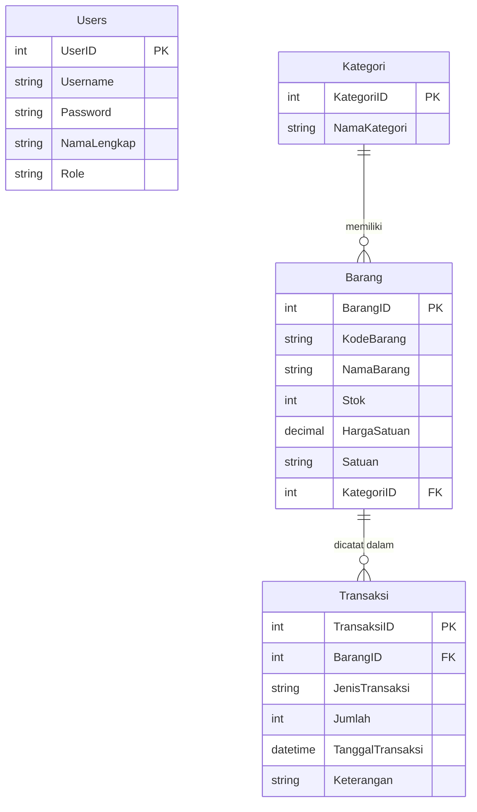

# 📦 Sistem Inventaris Barang (SiInventaris)

---

## 📋 Deskripsi Aplikasi

| Item | Detail |
|---|---|
| **Jenis Aplikasi** | Instansi — Manajemen Gudang / Inventaris |
| **Nama Aplikasi** | SiInventaris |
| **Tujuan** | Mengelola data barang, kategori, dan transaksi keluar masuk barang secara terkomputerisasi |
| **Target Pengguna** | Admin gudang / staf inventaris |

SiInventaris adalah aplikasi desktop berbasis **Windows Forms** yang dirancang untuk mempermudah pengelolaan inventaris barang di lingkungan instansi, kantor, atau gudang.

---

## ✨ Fitur Utama

1. **Login & Autentikasi Pengguna** — Sistem login dengan validasi username & password
2. **Manajemen Data Barang (CRUD)** — Tambah, lihat, edit, dan hapus data barang via DataGridView
3. **Pencatatan Transaksi Barang Masuk / Keluar** — Catat pergerakan stok barang
4. **Pencarian & Filter Data** — Cari barang berdasarkan nama/kode, filter per kategori

---

## 🔄 Alur Penggunaan

---

## 🛠️ Teknologi

| Teknologi | Keterangan |
|---|---|
| C# WinForms (.NET 8) | Framework utama antarmuka desktop |
| MaterialSkin.2 | Library UI Material Design untuk WinForms |
| SQL Server | Database relasional |
| ADO.NET | Akses data ke SQL Server |

---

## 🚀 Cara Setup

1. Jalankan `SQL/schema.sql` di SSMS untuk membuat database `InventarisDB`
2. Buka `SistemInventaris/SistemInventaris.csproj` di Visual Studio 2022
3. Restore NuGet packages (MaterialSkin.2 + System.Data.SqlClient)
4. Sesuaikan connection string di `DBHelper.cs` jika perlu
5. Tekan F5 untuk menjalankan
6. Login: **admin** / **admin123**

---

## 🗄️ Struktur Database

